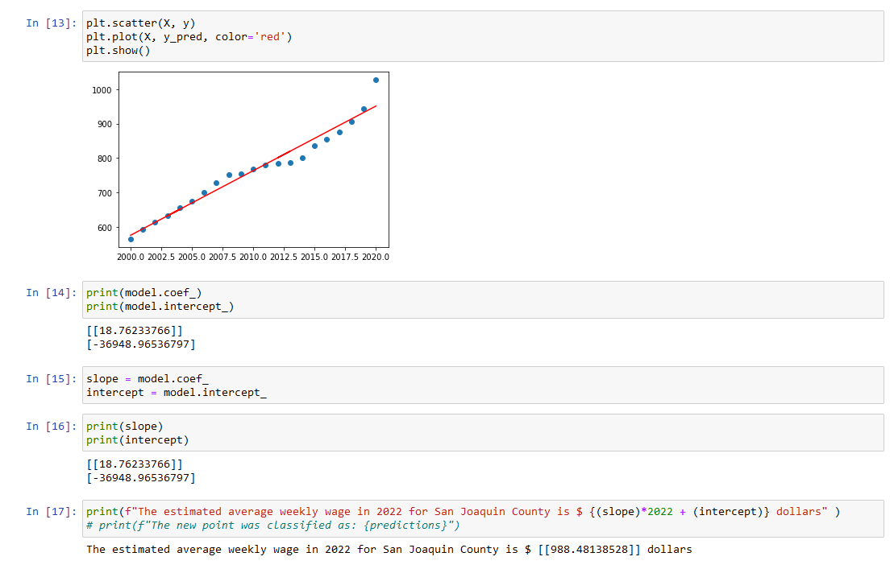
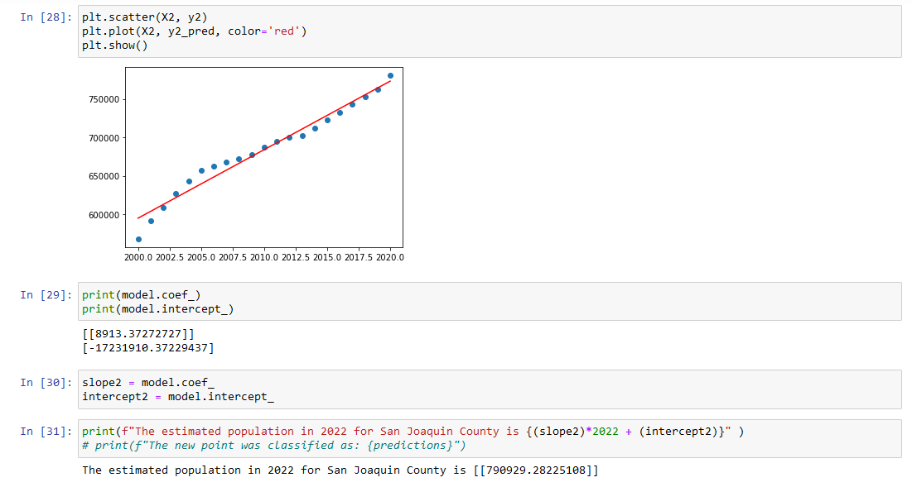
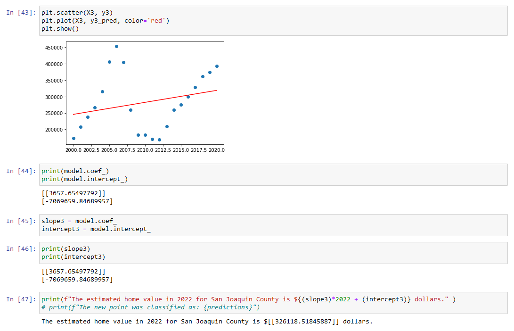
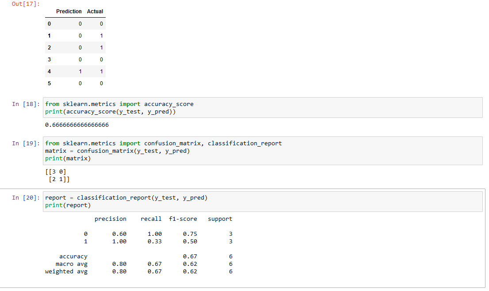
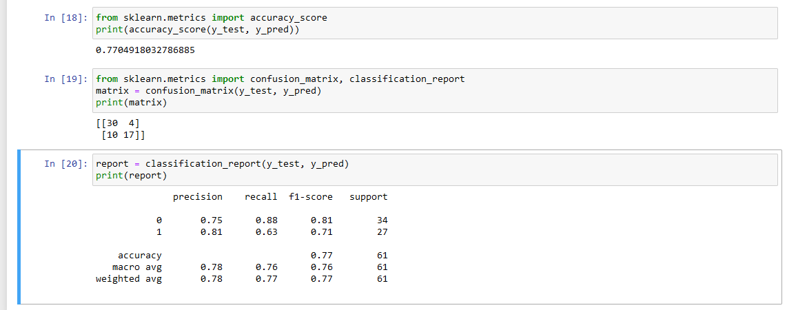
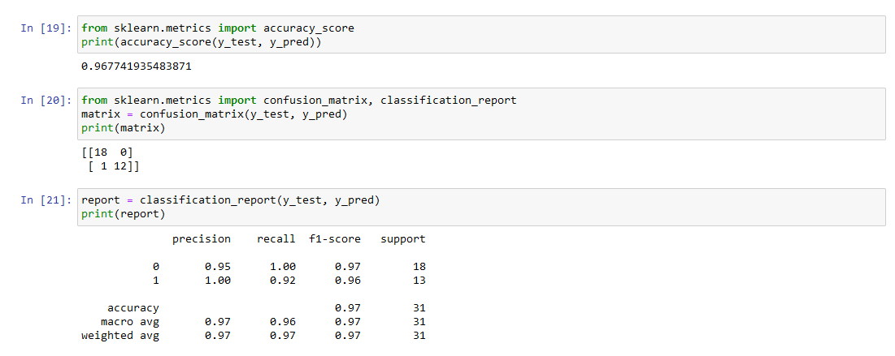
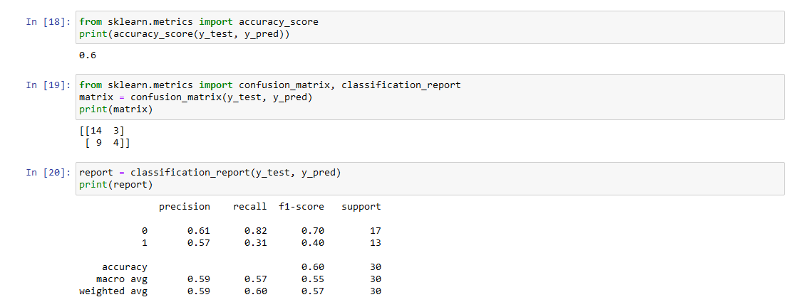

# Affordable_Housing_2023

## Overview

Initially, our group wanted to find affordable housing in all of California. For this deliverable, I have decided to focus on just one location, San Joaquin County. We defined the term "affordable" as 30% of the Average Yearly Income using a down payment of 20% with a 30-yr fixed interest rate at 5%. Since I was mainly focused on the San Joaquin County, I also considered mortgage rates in California with an applicant whose credit score was between 700-719. I used the 2020 Average Yearly Income data for San Joaquin County which was calculated as $49,300 or $1,233 monthly. This means the applicant is able to afford a home costing roughly $280,000 not including taxes and insurance. 

### Results

1. For the first machine learning model, I wanted to test the simplest model available, the LinearRegression model. I inputed Year vs. Wages, Year vs. Average Home Prices, and Year vs. Population separately to see if the model could predict a continous value using a trendline.

As you can see from the images, Year vs. Wages and Year vs. Population was easy to predict because the data was linear. Year vs. Average Home Prices had a difficult time predicting because of the Housing Market crash in 2008.

2. I concluded that using a LinearRegression model was too simple and unable to handle our data, so I switched over to a LogisticRegression model. 

The model was only 66% accurate at determining if a house was going to be affordable and I quickly realized there were not enough data points to train and test the model.

3. I broke the data down into months between the years 2000 and 2020 and had 241 rows of data instead of the original 21 rows of data.

The model had now improved to 77% accuracy.

4. For the next test, I decided that the Housing Market Crash in 2008 was an anomaly and that I wanted to look at data past that, specifically 2010-2020.

The model had now improved to 96% accuracy indicating that the Housing Market Crash in 2008 had a big impact on the data.

5. For the last test, since I used data from 2010-2020, I wanted to see how the remaining data would test, specifically 2000-2010.

The model had fallen back down to 60% accuracy indicating that the Housing Market Crash in 2008 had a big impact on the data.

### Summary

Overall, after looking at the results we achieved, we can conclude that:

1. A LinearRegression model is too simple to predict an outcome for all of our data.

2. Switching to a LogisticRegression model improved the prediction accuracy.

3. Having more data points was helpful in improving the prediction accuracy from 66% to 77% using the LogisticRegression model.

4. Using data after the Housing Market Crash in 2008, specifically from 2010-2020, the model improved to 96% accuracy, indicating that the Housing Market Crash in 2008 had a big impact on the data.

5. After including data before and during the Housing Market Crash in 2008, the model fell to 60% accuracy, again indicating that the Housing Market Crash in 2008 had a big impact on the data.

6. Moving forward, we need to add more feature variables into our database since we only currently have 2: Population and Income data. A feature variable I was considering was crime rate. Also, we should consider a more complex Machine Learning Model to be able to interpret our data and possibly give us better results.

